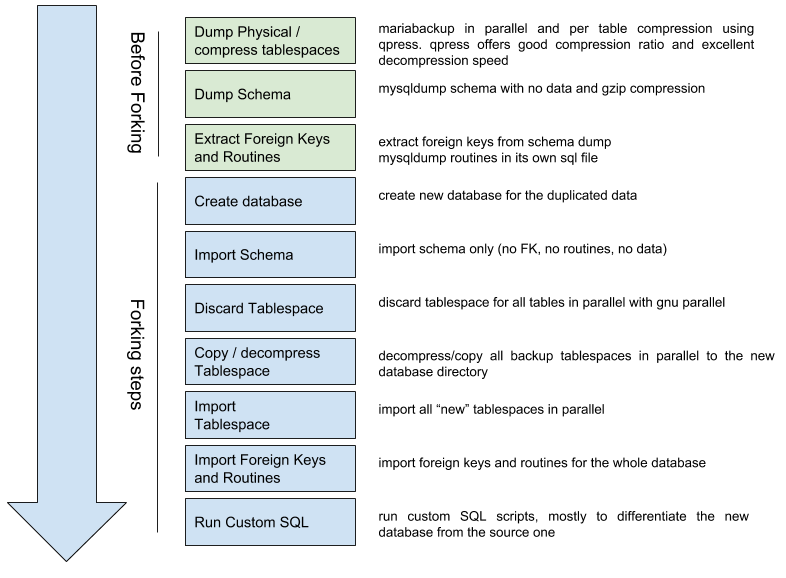

<a href="https://www.alumnforce.com/">
    

        
    

</a>

# MariaDB database forking

This repository hosts a collection of scripts can that can be used to create very quickly database clones without expensive mysqldumps / restores.

How it works
------------

    

Requirements (on the same machine)
----------------------------------

- mariadb or mysql on linux
- mysqldump
- mariabackup (or xtrabackup for mysql) 
- [qpress](http://www.quicklz.com/)
- [GNU parallel](https://www.gnu.org/software/parallel/)
- mariadb > 10.1.3 or mysql >= 5.7
- databases with innodb tables only
- source databases names must have a common pattern that can be matched with a regex (ex db_xxxx)